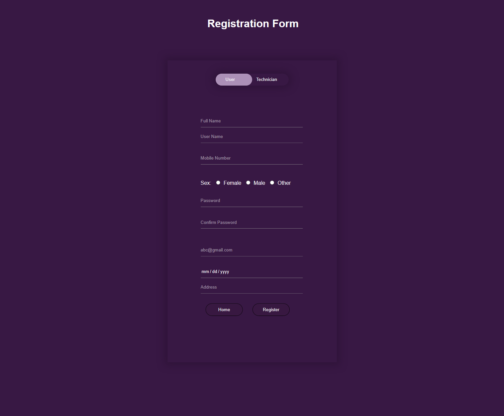

# Technician

A simple technician finder website where a random user can search a technician. It was my first team based project in spring semester of WEB Technology. PHP was used for backend part and for the frontend part css and bootstrap was used where my part was the frontend part. For the database MySql database was used.

_Snapshots:

